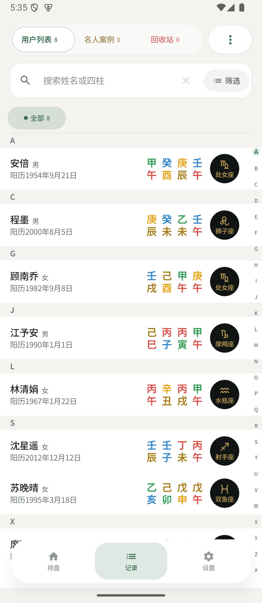
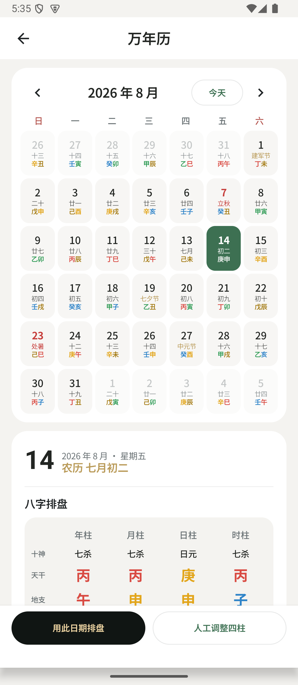

# 南枫八字

本地优先的 Android 八字排盘与命例研究工具。

[下载 Android 正式版](https://github.com/nanzhufeng/NanfengBazi-Android/releases/latest)

## 软件预览

当前首页预览来自 v1.0.14 的 API 35 模拟器构建（1140 × 2616）；其余页面预览保持独立手机视口。

<p align="center">
  
  
  
</p>

## 核心功能

- 离线排盘：公历、农历、四柱、时区与真太阳时口径。
- 命例管理：分组、标签、笔记、关键事件、筛选与回收站。
- 万年历：公农历、节气、日柱与用此日期排盘。
- 问真截图整理：识别结果可核对、可修改后再保存。

命例与资料默认保存在本机；云备份和 AI 点评均为可选功能。

## 开发

```bash
JAVA_HOME="/Applications/Android Studio.app/Contents/jbr/Contents/Home" ./gradlew test assembleDebug lintDebug
```
